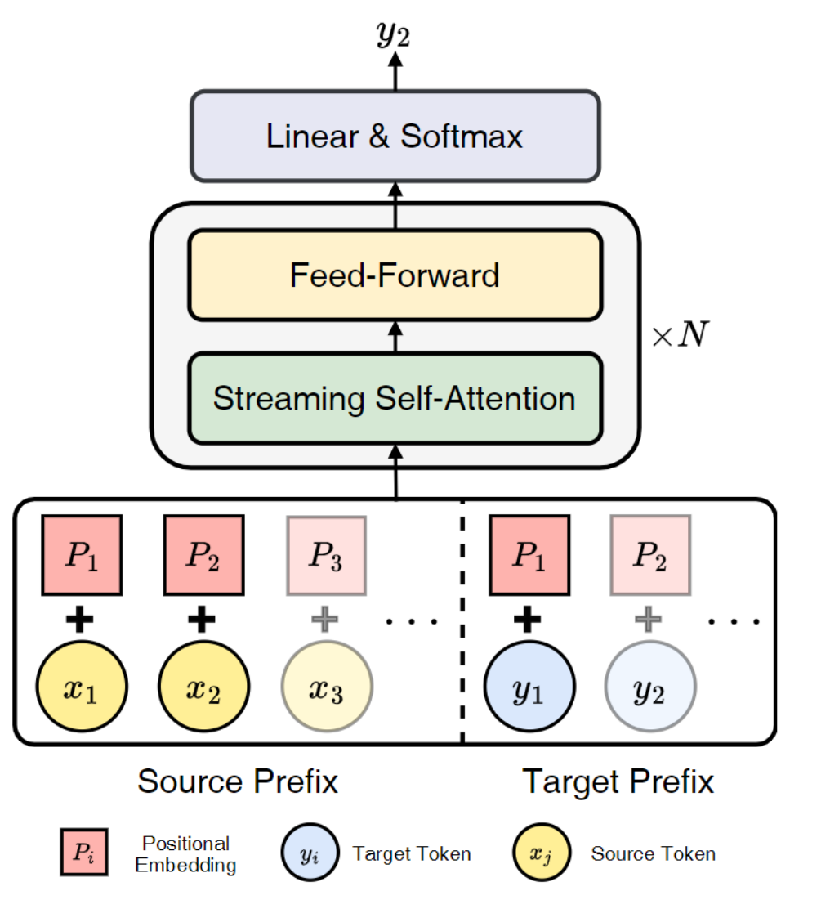

# DST
Source code for our ACL 2024 paper 'Decoder-only Streaming Transformer for Simultaneous Translation'

<div align="center">
  
</div>

<div align="center">
  The architecture of our Decoder-only Streaming Transformer.
</div>

**Highlights**

* Our method utilizes the Decoder-only architecture to determine the policy and translation concurrently.
* Our method alleviates the training and inference costs associated with using a Decode-only architecture.
* Our method attains the state-of-the-art performance on evaluation datasets.

## Requirements and Installation

* Python version = 3.8

* PyTorch version = 2.1

* Install our library:

```
git clone https://github.com/ictnlp/DST
cd DST
pip install --editable ./
```

## Data Pre-processing

We use the data of IWSLT15 English-Vietnamese (download [here](https://nlp.stanford.edu/projects/nmt/)), WMT16 English-Romanian (download [here](https://www.statmt.org/wmt16)) and WMT15 German-English (download [here](www.statmt.org/wmt15)).

For WMT15 German-English, we tokenize the corpus via [mosesdecoder/scripts/tokenizer/normalize-punctuation.perl](https://github.com/moses-smt/mosesdecoder) and apply BPE with 32K merge operations via [subword_nmt/apply_bpe.py](https://github.com/rsennrich/subword-nmt).

Then, we process the data into the fairseq format, adding ```--joined-dictionary``` for all tasks:

```
SRC=source_language
TGT=target_language
TRAIN_DATA=path_to_training_data
VALID_DATA=path_to_valid_data
TEST_DATA=path_to_test_data
DATA=path_to_processed_data

# add --joined-dictionary for WMT15 German-English
fairseq-preprocess --source-lang ${SRC} --target-lang ${TGT} \
    --trainpref ${TRAIN_DATA} --validpref ${VALID_DATA} \
    --testpref ${TEST_DATA}\
    --destdir ${DATA}
```

## Quick Start
Our approach involves full-sentence pre-training and simultaneous translation fine-tuning. The pre-training phase will utilize a full-sentence cross-entropy loss, while the simultaneous translation phase will employ the method described in our paper. The scripts of the training stage can be found in [train_scripts](https://github.com/ictnlp/DST/tree/main/train_scripts).

### Model Download
Considering the amount of training data for the WMT15 German-English task, we provide the corresponding models [[baidu]](https://pan.baidu.com/s/1009-05gjDiuA_7c1Y-Yr8Q?pwd=acj6 ).

### Full-Sentence Pre-training
In this phase, we train the Decoder-only model with the following full-sentence training loss to obtain good initial parameters .
```
export CUDA_VISIBLE_DEVICES=0,1,2,3

TGT_FILE=model_path
MODELFILE=checkpoints/${TGT_FILE}
DATAFILE=data_file

python train.py --ddp-backend=no_c10d ${DATAFILE} --arch transformer_lm \
 --task translation \
 --optimizer adam \
 --adam-betas '(0.9, 0.98)' \
 --clip-norm 0.0 \
 --lr 5e-4 \
 --lr-scheduler inverse_sqrt \
 --warmup-init-lr 1e-07 \
 --warmup-updates 4000 \
 --dropout 0.3 \
 --decoder-attention-heads 8 \
 --decoder-layers 16 \
 --criterion decoder_only \
 --report-accuracy \
 --label-smoothing 0.1 \
 --save-dir ${MODELFILE} \
 --max-tokens 8192 --update-freq 1 \
 --skip-invalid-size-inputs-valid-test \
 --keep-best-checkpoints 10 \
 --best-checkpoint-metric loss \
 --fp16 \
 --max-target-positions 1024 \
 --tokens-per-sample 1024 \
 --is-pretrain \
 --log-interval 100
```
### Simultaneous Translation Fine-Tuning
In this phase, we train the Decoder-only model to learn to proficiently translate within streaming scenarios.
```
export CUDA_VISIBLE_DEVICES=0,1,2,3

TRAIN_THRESHOLD=0.45
CURR_STEPS=50000
TGT_FILE=ckpt_${TRAIN_THRESHOLD}_${CURR_STEPS}
MODELFILE=checkpoints/${TGT_FILE}
DATAFILE=data_file

python train.py --ddp-backend=no_c10d ${DATAFILE} --arch transformer_lm \
 --task translation \
 --optimizer adam \
 --adam-betas '(0.9, 0.98)' \
 --clip-norm 0.0 \
 --lr 5e-4 \
 --lr-scheduler inverse_sqrt \
 --warmup-init-lr 1e-07 \
 --warmup-updates 4000 \
 --dropout 0.3 \
 --decoder-attention-heads 8 \
 --decoder-layers 16 \
 --criterion dst_loss \
 --report-accuracy \
 --label-smoothing 0.1 \
 --save-dir ${MODELFILE} \
 --max-tokens 2048 --update-freq 4 \
 --skip-invalid-size-inputs-valid-test \
 --keep-best-checkpoints 10 \
 --best-checkpoint-metric loss \
 --max-target-positions 1024 \
 --tokens-per-sample 1024 \
 --reset-optimizer \
 --reset-lr-scheduler \
 --reset-meters \
 --reset-dataloader \
 --train-threshold ${TRAIN_THRESHOLD} \
 --curr-steps ${CURR_STEPS} \
 --log-interval 100
```

### Inference
We evaluate the model with the following command. It can be found in [inference_scripts](https://github.com/ictnlp/DST/tree/main/inference_scripts).

```
export CUDA_VISIBLE_DEVICES=0

TGT_FILE=model_path
MODELFILE=checkpoints/${TGT_FILE}
DATAFILE=data_file
THRESHOLD=infer_threshold
REFERENCE=ref.txt

python fairseq_cli/generate.py ${DATAFILE} --path ${MODELFILE} --batch-size 100 --beam 1 --remove-bpe --threshold ${THRESHOLD} --preRead 2 --soft-attention > decoding.txt
grep ^H decoding.txt | cut -f1,3- | cut -c3- | sort -k1n | cut -f2- > translation.txt
./multi-bleu.perl -lc ${ref.txt} < translation.txt
```

## Citation
If you have any questions, please feel free to submit an issue or contact guoshoutao22z@ict.ac.cn.

If our work is useful for you, please cite as:


```
@inproceedings{dst,
    title = "Decoder-only Streaming Transformer for Simultaneous Translation",
    author = "Guo, Shoutao  and
              Zhang, Shaolei  and
              Feng, Yang",
    booktitle = "Proceedings of the 62th Annual Meeting of the Association for Computational Linguistics (Long Papers)",
    month = Aug,
    year = "2024",
    publisher = "Association for Computational Linguistics",
    address = "Bangkok, Thailand",
}      
```
